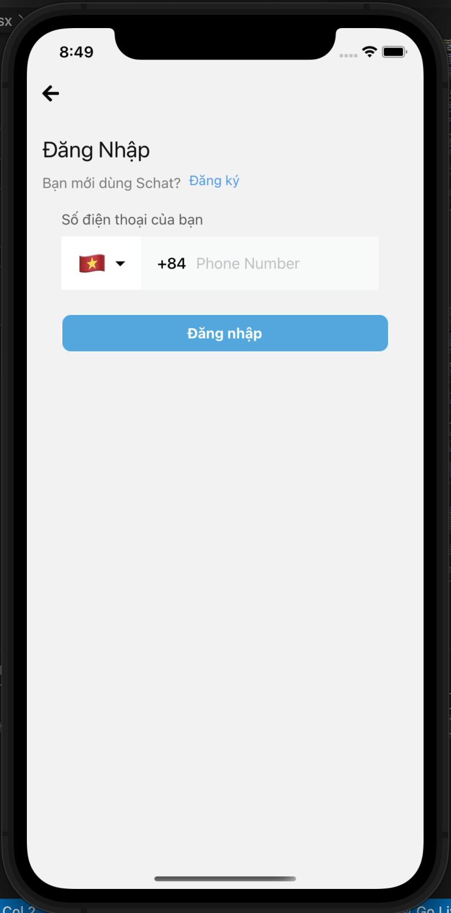

# SChat - Secure chat mobile application.


## Table of Contents
* [Introduction](#introduction)
* [Video Demo](#video-demo)
* [Technologies Used](#technologies-used)
* [Features](#features)
* [How to install and run the project](#how-to-install-and-run-the-project)
* [Acknowledgements](#acknowledgements)
* [License](#license)

<!-- * [License](#license) -->


## Introduction

SChat is a fantastic messaging solution for security-conscious mobile users. It's a free all-in-one messaging and attachments and media messages solution that uses its own end-to-end encryption algorithm.

SChat use ECDH to generate shared-secret to encrypt and decrypt messages. The attachments are encrypted via RSA key and AES before archiving on IPFS.

This is the [Software Requirements Document](https://drive.google.com/file/d/1a05Xv4THXcylsYXK4mVO170_owQaSECp/view?usp=sharing)





## Video Demo
You can have a look with SChat through [the video](https://drive.google.com/file/d/1z95rzWRYfh2SW-ufw-0Oo82UPOePvdob/view?usp=sharing).


## Technologies Used
SChat use the following technologies, frameworks and development techniques:
- Backend - [NestJs](https://nestjs.com)
- Mobile - [React Native](https://reactnative.dev)
- Database - [MongoDB](https://www.mongodb.com/)
- Ethereum blockchain - [Ethereum](https://ethereum.org/en/)
- IPFS network - [IPFS](https://ipfs.io)
- Project Management - [Azure DevOps](https://azure.microsoft.com/en-us/services/devops/)


## Features
Features on Schat:
- Log in
- Registration
- Encrypted chat
- Send encrypted files


## How to install and run the project

To clone and run this application, you'll need [Npm - package manager](https://www.npmjs.com/), [NodeJs](https://nodejs.org/en/), [Visual Studio Code](https://code.visualstudio.com/), [Truffle](https://trufflesuite.com), [IPFS](https://docs.ipfs.io) installed on your computer. 

```
*** Run Back-end

$ cd backend
$ npm install
$ npm run start:dev
```

```
*** Run Front-end

$ cd frontend
$ expo start
```

```
*** Run Ethereum Virtual Node

Open ganache 
```

```
*** Run IPFS Node

# create new ipfs node
$ ipfs init 

# run ipfs node
$ ipfs daemon 

```

```
The server is listening at port 3000 
```

## Acknowledgements
- Thanks to [NestJS](https://nestjs.com) for supporting us with NestJS document
- Thanks to [Npm - package manager](https://www.npmjs.com/) for supporting us to use library community
- Thanks to [React Native](https://reactnative.dev)
- Thanks to [Ethereum](https://ethereum.org/en/developers/docs/)
- Thanks to [IPFS](https://docs.ipfs.io)
- Thanks to [Stackoverflow](https://stackoverflow.com/) for supporting us 
- Thanks to [Github](https://github.com/) for supporting us control application's versions 


## Development Team
- [Tran Quoc Thang](https://github.com/LucasTran-tq)
- [Nguyen Huu Phat](https://github.com/nguyenhuuphat2001)


## License

Copyright © 2021. <br />
This project is [MIT](https://github.com/LucasTran-tq/Schat-uit/blob/main/LICENSE) licensed.
